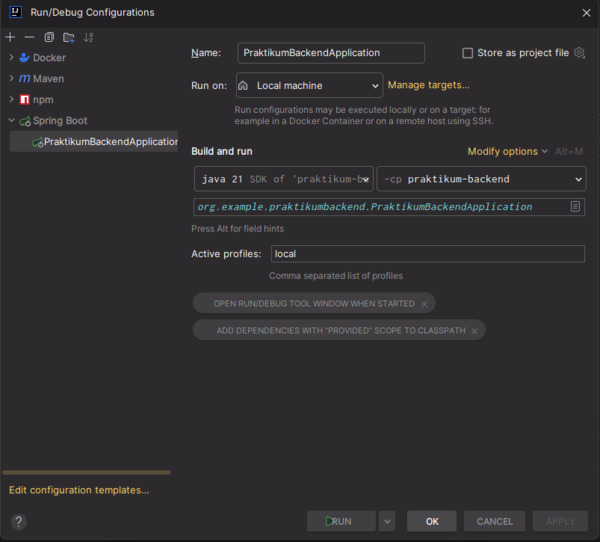

# How to run Locally

## Start Database Container
```bash
docker compose up
```
(If you want to persist your database, add a volume to the docker compose file)

You can also start it directly with docker (`docker run ...`; get the appropriate parameters from the docker-compose.yml file.

## Run the app with local Profile

### Via IntelliJ
Set active Profile to `local`:



### Via Command Line
```bash
./mvnw spring-boot:run -Dspring-boot.run.profiles=local
```

(You may have to `chmod +x ./mvnw` first after checkout)
